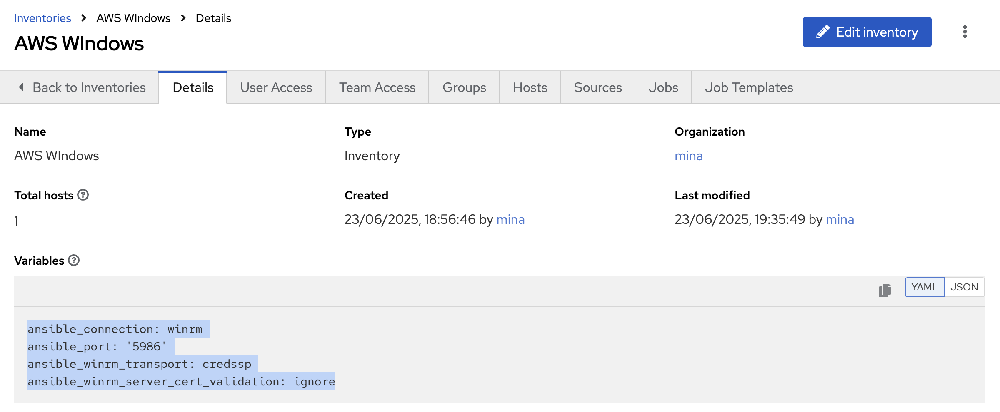

# Build WIN Private Public Cloud

## Objective
To enable Public Cloud (AWS) provisioning for WIN 2022 Instances via AAP


## Return to Menu
 - [Menu of Exercises](../README.md)

## Summary of steps
1. Examine the Code to provision WIN 2022 EC2 instance in AWS 
2. Create AAP Job Template to Build  WIN 2022 EC2 instance in AWS
3. Examine the created instance in the AWS account and check the details/Tags

---

### Step 1 - Create your AWS Credentials in AAP (you have created this in the previous excercise so you can skip this step)

1. Create a new Credential with the following parameters:


* name: AWS Creds 
* organization: *\<your username\>*
* Credential Type: Amazon Web Services
* Access Key: *\<your access key\>*
* Secret Key: *\<your secret key\>*

  Save Credential. Should look like the below 

  

---

### Step 2 - Create Dynamic Inventory in AAP

1. Create a new inventory with the following parameters:

* name: AWS Windows
* organization: *\<your username\>*
* Variables:
  ```yaml
  ansible_connection: winrm
  ansible_port: '5986'
  ansible_winrm_transport: credssp
  ansible_winrm_server_cert_validation: ignore
  ```

  Save Inventory. Should look like the below 

  


2. In the created inventory, click on **Sources** -> **Create Source** with the following parameters

* name: EC2 Windows 
* Execution environment: Default Execution Environment
* Source: Amazon EC2
* Credentials: AWS Creds
* Verbosity: 1
* Options:
  * Select: Overwrite 
  * Select: Overwrite Variables 
* Source Variables
  ```yaml
  regions:
    - ap-southeast-2
  filters:
    instance-state-name: running
    tag:OS: win2022
    tag:Student: *\<your username\>*
  plugin: amazon.aws.aws_ec2
  compose:
    ansible_host: public_ip_address
  ```

  Save Source. Should look like the below 

  


  On the next Page, Sync Inventory and validate it is successful (no hosts yet in AWS)


---

### Step 3 - Create Job Template in AAP

Create a new Job Template with the following parameters:

* name: AWS - Provision VM Win
* organization: *\<your username\>*
* Inventory: localhost
* project: Workshop Repo
* Execution environment: Default Execution Environment
* Playbook: playbooks/ec2-provision-win2022.yml
* Credential: 
  * AWS Creds
  * Workshop Vault Credential
* Extra variables (Do not forget to you your username provided)
  * ```yaml
    v_instance_count: 1
    student_name: <your username>
    ```

  Save Template. Should look like the below 

  
      

---

### Step 4 - Run Job Template in AAP

Go to Automation Execution -> Templates ->  AWS - Provision VM Win and Launch the template

Inspect the output and login to your AWS Environment and check the created instance/tags 

Should look something like the below 


---

### Step 5 - Run Job Template in AAP AGAIN !

Repeat Step 4 .. And examine the idempotent behavior that the instance state is maintained with no changed to the running instance state 

This is achieved by this part of the ansible code 

```yaml
    exact_count: "{{ v_instance_count }}"
    filters:
      instance-state-name: running
      "tag:workshop_os_type": "{{ ec2_name_prefix }}-{{ workshop_type }}-{{ aws_host_os }}"
```

### Step 5 - Bonus Step !

Edit the extra variables in the Job Template and set `v_instance_count: 2` 


>⚠️ ***Caution***
Please use only 2 .. as that may lock us out of the lab :) .

---

### Step 6 - Update the Job Template in AAP to terminate the WIN Instances

Update the Job Template `AWS - Terminate EC2` with the following parameters:

* Extra variables (Do not forget to you your username provided)
    ```yaml
    aws_host_os: win2022
    student_name: *\<your username\>*
    ```

This is intentional as we will use this parameterization later on 

Save Template. Should look like the below 


      

Launch the template 


Example Output 


And validate that the Windows instance is gone in AWS Console 

---

### Step 7 - IMPORTAN. Update the Job Template in AAP to terminate the WIN Instances and REmove the Extra Vars 

Should end up looking like this 


