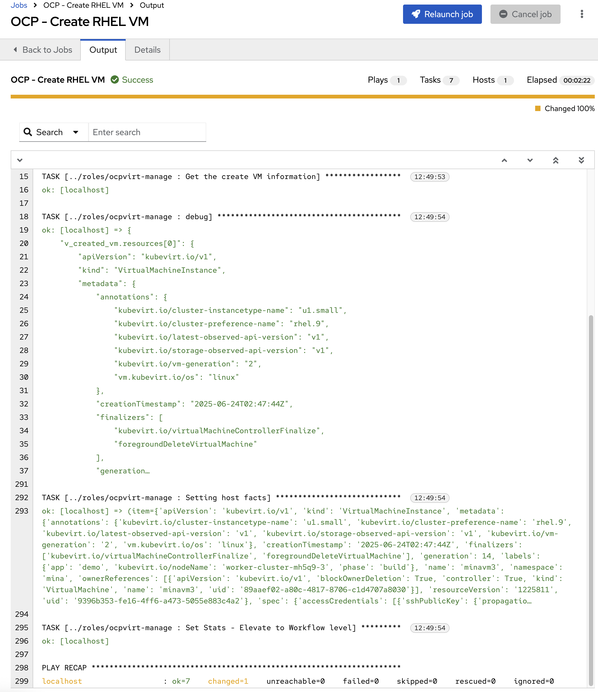

# Build RHEL Private Cloud

## Objective
To enable Private Cloud (OCP Virt) provisioning for RHEL9 Instances via AAP


## Return to Menu
 - [Menu of Exercises](../README.md)

## Summary of steps
1. Examine the Code to provision RHEL VM on OCP Virt 
2. Create AAP Job Template to Build  RHEL VM on OCP Virt
3. Examine the created instance in the OpenShift Platform using the credentials Provided 


---

### Step 1 - Create Dynamic Inventory in AAP

1. Create a new inventory with the following parameters:

* name: OCP RHEL

* organization: *\<your username\>*


  Save Inventory. Should look like the below 

  

---


2. In the created inventory, click on **Sources** -> **Create Source** with the following parameters

* name: OCP RHEL 
* Execution environment: OCP Virt EE
* Source: OpenShift Virtualization
* Credentials: OCP Cluster
* Verbosity: 1
* Options:
  * Select: Overwrite 
  * Select: Overwrite Variables 
* Source Variables
  ```yaml
  connections:
    - namespaces:
        - *\<your username\>*
      label_selector: app=demo
  ```

  Save Source. Should look like the below 

  


  On the next Page, Sync Inventory and validate it is successful (no hosts yet in AWS)

---

### Step 3 - Create Job Template in AAP (OCP - Create RHEL VM)

Create a new Job Template with the following parameters:

* name: OCP - Create RHEL VM
* organization: *\<your username\>*
* Inventory: localhost
* project: Workshop Repo
* Execution environment: OCP Virt EE
* Playbook: playbooks/ocp-create-vm.yml
* Credential: 
  * OCP Cluster
  * Workshop Vault Credential
* Extra variables (Do not forget to you your username provided)
    ```yaml
    v_vm_namespace: *\<your username\>*
    v_vm_name: *\<your username\>*
    v_vm_instancetype: u1.small
    v_vm_preference: rhel.9
    v_vm_datastore: rhel9
    v_vm_os_disk_size: 30
    v_vm_location: Australia
    v_lcy_environment: Production
    v_vm_label: demo
    v_ocp_cluster_api: https://api.cluster-mh5q9.dynamic.redhatworkshops.io:6443
    ```

    Save Template. Should look like the below

    
      

---

### Step 4 - Run Job Template in AAP

Go to Automation Execution -> Templates ->  OCP - Create RHEL VM and Launch the template

Inspect the output and login to your Openshift Environment and check the created instance/tags 

Should look something like the below 

  


---

### Step 5 - Create Job Template in AAP to Delete the RHEL VM (OCP - Delete VM)

Create a new Job Template with the following parameters:

* name: OCP - Delete VM
* organization: *\<your username\>*
* Inventory: localhost
* project: Workshop Repo
* Execution environment: OCP Virt EE
* Playbook: playbooks/ocp-delete-vm.yml
* Credential: 
  * OCP Cluster
  * Workshop Vault Credential
* Extra variables (Do not forget to you your username provided)
  
    ```yaml
    v_vm_namespace: *\<your username\>*
    v_vm_name: *\<your username\>*
    v_ocp_cluster_api: https://api.cluster-mh5q9.dynamic.redhatworkshops.io:6443
    ```

Save Template. Should look like the below 
  
  
      

Launch the template 


Example Output 

  


And validate that the RHEL instance is gone in AWS Console 


