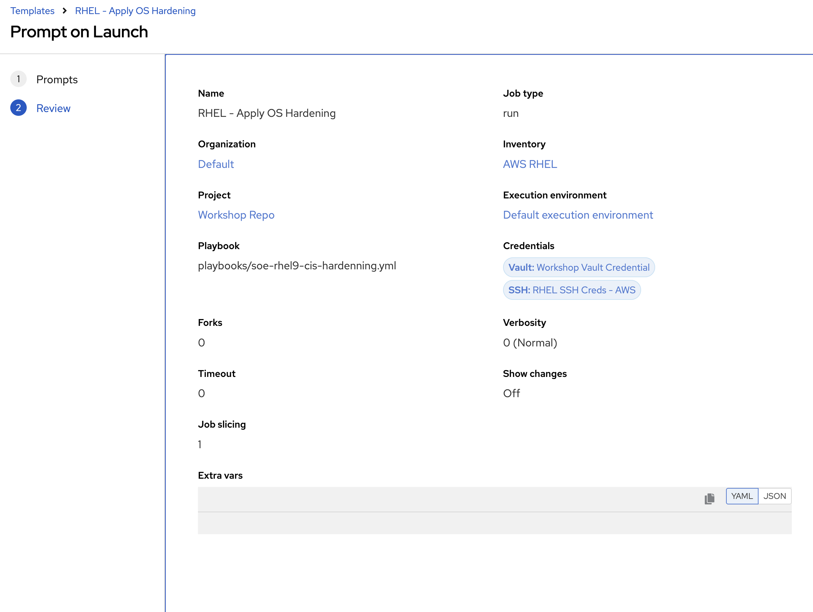

# RHEL OS Patching/Config/Hardening

## Objective
To enable RHEL9 Day 2 operations via AAP

## Return to Menu
 - [Menu of Exercises](../README.md)

## Summary of steps
1. Examine the Code to Patch and Apply OS Config to a RHEL9 instance in AWS/OCP Virt 
2. Create AAP Job Template to Patch and Apply OS Config/hardening to a RHEL9 instance in AWS/OCP Virt 

### Step 1 - Build RHEL9 instance on AWS 

Well you know what to do :) 

### Step 2 - Re-sync the Inventory Source for EC2 RHEL instances
 
Well you know what to do :) 

### Step 3 - Create Job Template in AAP (Patching/Config)

Create a new Job Template with the following parameters:

* name: RHEL - Apply OS Config
* organization: *\<your username\>*
* Inventory: \<LEAVE Blank\> and Select `Prompt on Launch` 
* project: Workshop Repo
* Execution environment: Default Execution Environment
* Playbook: playbooks/rhel-os-config.yml
* Credential: \<LEAVE Blank\> and Select `Prompt on Launch` 

  Save Template. Should look like the below 

  

 Launch the template and select 

* Inventory: AWS RHEL

* Credential: 
  * RHEL SSH Creds - AWS 

  * Workshop Vault Credential

  

  

Example Output 

### Step 4 - Create Job Template in AAP (Hardening)

Create a new Job Template with the following parameters:

* name: RHEL - Apply OS Hardening
* organization: *\<your username\>*
* Inventory: \<LEAVE Blank\> and Select `Prompt on Launch` 
* project: Workshop Repo
* Execution environment: Default Execution Environment
* Playbook: playbooks/soe-rhel9-cis-hardenning.yml
* Credential: \<LEAVE Blank\> and Select `Prompt on Launch` 

  Save Template. Should look like the below 

  

 Launch the template and select 

* Inventory: AWS RHEL

* Credential: 
  * RHEL SSH Creds - AWS 

  * Workshop Vault Credential

  

  

Example Output 

