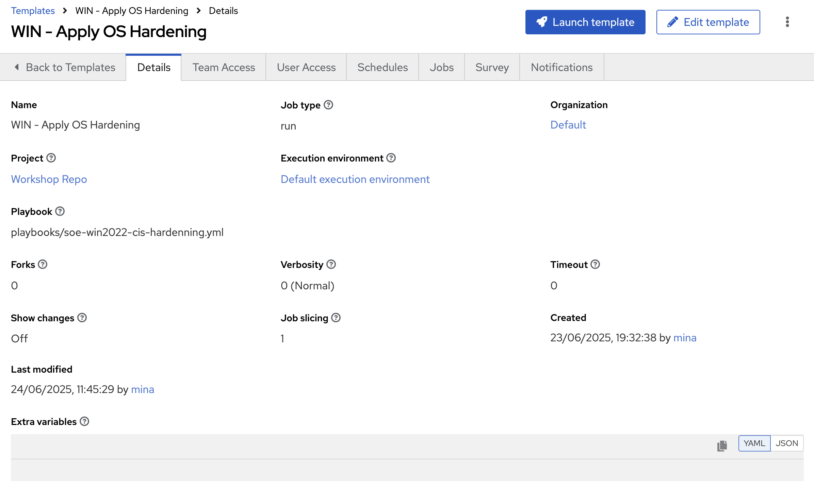
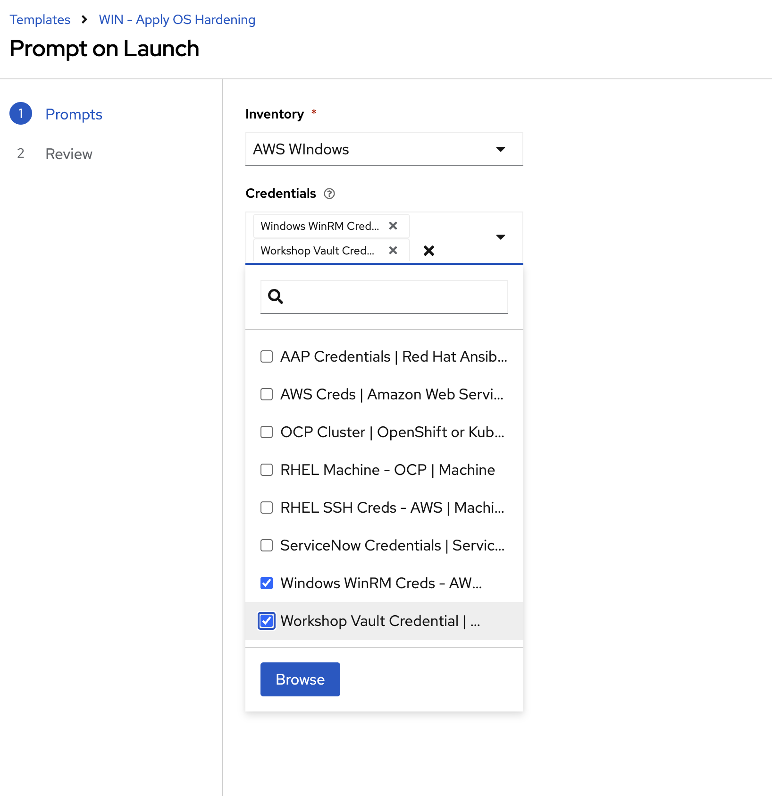
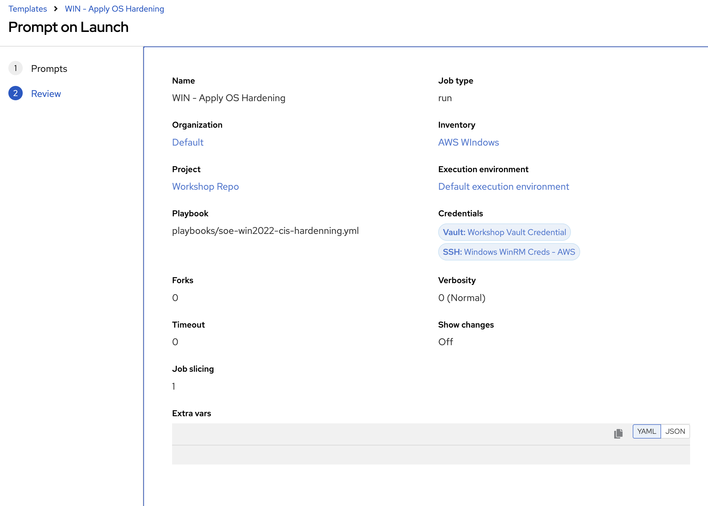
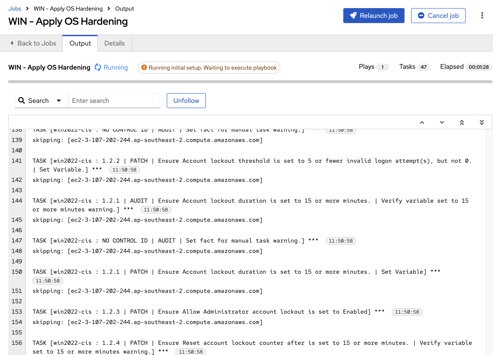

# RWindowsHEL OS Patching/Config/Hardening

## Objective
To enable Win222 Day 2 operations via AAP

## Return to Menu
 - [Menu of Exercises](../README.md)

## Summary of steps
1. Examine the Code to Patch and Apply OS Config to a Win222 instance in AWS/OCP Virt 
2. Create AAP Job Template to Patch and Apply OS Config/hardening to a Win222 instance in AWS/OCP Virt 

> ⚠️ **Important**
>
> We had issues with with AWS patching from the backend ..HArdening will serve as the same conceptual placeholder.

### Step 1 - Build Win222 instance on AWS 

Well you know what to do :) 

### Step 2 - Re-sync the Inventory Source for EC2 Windows instances
 
Well you know what to do :) 

### Step 4 - Create Job Template in AAP (Hardening)

Create a new Job Template with the following parameters:

* name: WIN - Apply OS Hardening
* organization: *\<your username\>*
* Inventory: \<LEAVE Blank\> and Select `Prompt on Launch` 
* project: Workshop Repo
* Execution environment: Default Execution Environment
* Playbook: playbooks/soe-win2022-cis-hardenning.yml
* Credential: \<LEAVE Blank\> and Select `Prompt on Launch` 

  Save Template. Should look like the below 

  

 Launch the template and select 

* Inventory: AWS RHEL

* Credential: 

  * RHEL SSH Creds - AWS 

  * Workshop Vault Credential

  

  

Example Output 

