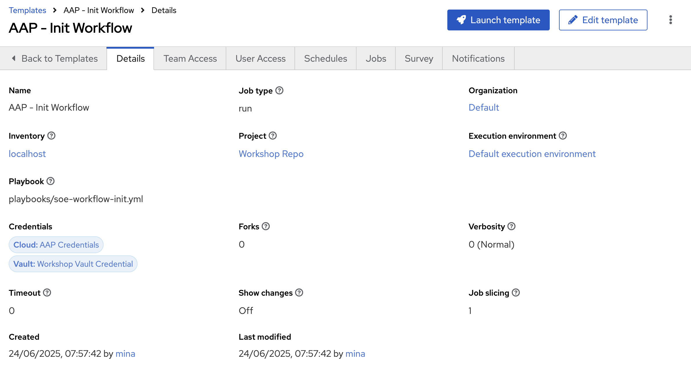

# WorkFlow - Build RHEL Private/Public Cloud

## Objective

To enable end to end provisioning process automation on any cloud, in consistent approach, for RHEL instances


## Return to Menu

 - [Menu of Exercises](../README.md)

## Summary of steps
    
1. Create AAP Job Templates to Build  and End to End Workflow in AAP
2. re-use the created Job Templates to Create an Automation Workflow
3. Build the workflow with Happy/Exception path logic (yes with ServiceNow Integration)


---

### Step 1 - Create Job Template in AAP (SNOW)

Create a new Job Template with the following parameters:

* name: SNOW - Raise INC
* organization: *\<your username\>*
* Inventory: localhost
* project: Workshop Repo
* Execution environment: Default Execution Environment
* Playbook: playbooks/snow-create-inc.yml
* Credential: 
  * ServiceNow Credentials
  * Workshop Vault Credential


    Save Template. Should look like the below 
    

---

### Step 2 - Create Job Template in AAP (AAP - Init Workflow)

Create a new Job Template with the following parameters:

* name: AAP - Init Workflow
* organization: *\<your username\>*
* Inventory: localhost
* project: Workshop Repo
* Execution environment: Default Execution Environment
* Playbook: playbooks/soe-workflow-init.yml
* Credential: 
  * AAP Credentials
  * Workshop Vault Credential


    Save Template. Should look like the below 


    

---

### Step 3 - Create Workflow Job Template WFJT in AAP for RHEL on AWS

Create a new Workflow Job Template with the following parameters:

  

* name: WFJT - Provision RHEL on AWS Cloud
* organization: *\<your username\>*
* Extra variables (Do not forget to you your username provided)
    ```yaml
    v_instance_count: 1
    student_name: mina
    aws_host_os: rhel9
    ```
*  Notice that now we are moving all extra vars to Workflow Level to have highest precedence .. and notice how we will leverage `prompt_on_launch` that we set on some JTs so we can re-use our automation code
*

  Save Template. Once Saved, Click on the Workflow Visualiser 

  


 Create the Nodes and Arrange them to look like the following (Guidance on the Main screen)


---

### Step 4 - RUN the Workflow Job Template WFJT (WFJT - Provision RHEL on AWS Cloud)

---


### Step 5 - Now Lets repeat the same for WFJT - Provision RHEL on OCP Virt

Create a new Workflow Job Template with the following parameters:

  

* name: WFJT - Provision RHEL on OCP Virt
* organization: *\<your username\>*
* Extra variables (Do not forget to use your username provided)

    ```yaml
    v_ocp_cluster_api: https://api.cluster-mh5q9.dynamic.redhatworkshops.io:6443
    v_vm_namespace: *\<your username\>*
    v_vm_name: *\<your username\>*
    v_vm_instancetype: u1.small
    v_vm_preference: rhel.9
    v_vm_datastore: rhel9
    v_vm_os_disk_size: 30
    v_vm_location: Australia
    v_lcy_environment: Production
    v_vm_label: demo
    ```


 Create the Nodes and Arrange them to look like the following (Guidance on the Main screen)

  